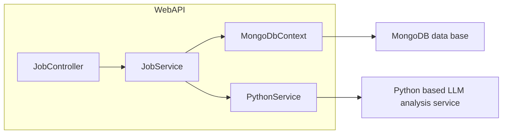

# Backend Job Description API Documentation

## 📋 Index
1. [Config/AppSettings.cs](#configappsettingscs)  
2. [Controllers/JobController.cs](#controllersjobcontrollercs)  
3. [Data/MongoDbContext.cs](#datamongodbcsp)  
4. [Models/JobDescription.cs](#modelsjobdescriptioncs)  
5. [Models/RequestModels.cs](#modelsrequestmodelscs)  
6. [Performance/load.js](#performanceloadjs)  
7. [Properties/launchSettings.json](#propertieslaunchsettingsjson)  
8. [Services/JobService.cs](#servicesjobservicecs)  
9. [Services/PythonService.cs](#servicespythonservicecs)  
10. [Program.cs](#programcs)  
11. [appsettings.json](#appsettingsjson)  
12. [backend-jd-api.csproj](#backend-jd-apicsproj)  
13. [backend-jd-api.http](#backend-jd-apihttp)  
14. [Tests/Controllers/JobControllerTests.cs](#testscontrollersjobcontrollertestscs)  
15. [Tests/Services/JobServiceTests.cs](#testsservicesjobservicetestscs)  
16. [Tests/Services/PythonServiceTests.cs](#testsservicespythonservicetestscs)  
17. [backend-jd-api.Tests.csproj](#backend-jd-apitestscsproj)  
18. [Dockerfile](#dockerfile)  
19. [docker-compose.yml](#docker-composeyml)  

---

## 1. Config/AppSettings.cs

**Purpose:** Centralizes application configuration pulled from *appsettings.json* into strongly-typed objects.

```csharp
public class AppSettings
{
    public DatabaseConfig Database { get; set; } = new();
    public PythonApiConfig PythonApi { get; set; } = new();
    public FileConfig Files { get; set; } = new();
}

public class DatabaseConfig
{
    public string ConnectionString { get; set; } = "mongodb://localhost:27017";
    public string DatabaseName     { get; set; } = "JobAnalyzerDB";
    public string CollectionName   { get; set; } = "JobDescriptions";
}

public class PythonApiConfig
{
    public string BaseUrl       { get; set; } = "http://localhost:8000";
    public int    TimeoutSeconds{ get; set; } = 300;
}

public class FileConfig
{
    public long         MaxSizeMB     { get; set; } = 10;
    public List<string> AllowedTypes  { get; set; } = new() { ".txt", ".pdf", ".doc", ".docx" };
}
```
- **DatabaseConfig**: MongoDB connection settings.  
- **PythonApiConfig**: Base URL and timeout for the Python microservice.  
- **FileConfig**: Max upload size and permissible extensions.  

---

## 2. Controllers/JobController.cs

**Purpose:** Defines REST endpoints for uploading, analyzing, retrieving, and deleting job descriptions.

```csharp
[ApiController]
[Route("api/jobs")]
public class JobController : ControllerBase
{
    private readonly IJobService _jobService;
    private readonly ILogger<JobController> _logger;

    public JobController(IJobService jobService, ILogger<JobController> logger)
    {
        _jobService = jobService;
        _logger     = logger;
    }

    // Validates text length, repetition, gibberish, etc.
    private (bool isValid, string errorMessage) ValidateJobDescriptionText(string text) { ... }

    [HttpPost("upload")]
    public async Task<IActionResult> UploadFile([FromForm] UploadRequest request) { ... }

    [HttpPost("analyze")]
    public async Task<IActionResult> AnalyzeText([FromBody] AnalyzeRequest request) { ... }

    [HttpGet("{id}")]
    public async Task<IActionResult> GetJob(string id) { ... }

    [HttpGet]
    public async Task<IActionResult> GetAllJobs([FromQuery] int skip=0, [FromQuery] int limit=20) { ... }

    [HttpGet("user/{email}")]
    public async Task<ActionResult<List<JobDescription>>> GetUserJobs(string email) { ... }

    [HttpDelete("{id}")]
    public async Task<IActionResult> DeleteJob(string id) { ... }
}
```

### Interactive API Documentation

```api
{
  "title": "Upload Job Description File",
  "description": "Upload a file (txt/pdf/doc/etc.) for bias analysis",
  "method": "POST",
  "baseUrl": "https://localhost:5268",
  "endpoint": "/api/jobs/upload",
  "headers": [
    {"key": "Content-Type", "value": "multipart/form-data", "required": true}
  ],
  "bodyType": "form",
  "formData": [
    {"key": "file", "value": "Binary file stream", "required": true},
    {"key": "userEmail", "value": "User's email address", "required": true}
  ],
  "responses": {
    "200": {
      "description": "Analysis complete",
      "body": "{ \"id\": \"507f...\", \"analysis\": { ... } }"
    },
    "400": { "description": "Validation error", "body": "{ \"error\": \"Text is required\" }" },
    "500": { "description": "Server error",   "body": "{ \"error\": \"An error occurred...\" }" }
  }
}
```

```api
{
  "title": "Analyze Text Directly",
  "description": "Submit raw text for bias analysis",
  "method": "POST",
  "baseUrl": "https://localhost:5268",
  "endpoint": "/api/jobs/analyze",
  "headers": [
    {"key": "Content-Type", "value": "application/json", "required": true}
  ],
  "bodyType": "json",
  "requestBody": "{\n  \"text\": \"Job description text...\",\n  \"userEmail\": \"john@example.com\",\n  \"jobTitle\": \"Software Engineer\"\n}",
  "responses": {
    "200": { "description": "Analysis result", "body": "{ \"id\": \"507f...\", ... }" },
    "400": { "description": "Validation error" },
    "500": { "description": "Server error" }
  }
}
```

---

## 3. Data/MongoDbContext.cs

**Purpose:** Encapsulates MongoDB connectivity and provides CRUD methods for `JobDescription` entities.

```csharp
public class MongoDbContext
{
    private readonly IMongoDatabase _database;
    private readonly IMongoCollection<JobDescription> _jobs;

    public MongoDbContext(AppSettings settings)
    {
        var client    = new MongoClient(settings.Database.ConnectionString);
        _database     = client.GetDatabase(settings.Database.DatabaseName);
        _jobs         = _database.GetCollection<JobDescription>(settings.Database.CollectionName);
    }

    public IMongoCollection<JobDescription> Jobs => _jobs;
    public IMongoDatabase              Database => _database;

    public virtual Task<JobDescription> CreateJobAsync(JobDescription job)   => _jobs.InsertOneAsync(job).ContinueWith(_ => job);
    public virtual Task<JobDescription?> GetJobAsync(string id)             => _jobs.Find(x=>x.Id==id).FirstOrDefaultAsync();
    public virtual Task<List<JobDescription>> GetAllJobsAsync(int skip,int limit)
        => _jobs.Find(_=>true).Skip(skip).Limit(limit).SortByDescending(x=>x.CreatedAt).ToListAsync();
    public virtual Task<JobDescription> UpdateJobAsync(JobDescription job)   => _jobs.ReplaceOneAsync(x=>x.Id==job.Id, job).ContinueWith(_=>job);
    public virtual Task<bool> DeleteJobAsync(string id)
        => _jobs.DeleteOneAsync(x=>x.Id==id).ContinueWith(t=>t.Result.DeletedCount>0);
    public virtual Task<List<JobDescription>> GetJobsByUserEmailAsync(string email)
        => _jobs.Find(x=>x.UserEmail==email).SortByDescending(x=>x.CreatedAt).ToListAsync();
}
```

---

## 4. Models/JobDescription.cs

**Purpose:** Domain model representing a job description and its analysis.

```csharp
public class JobDescription
{
    [BsonId] 
    [BsonRepresentation(BsonType.ObjectId)]
    public string Id { get; set; } = string.Empty;

    public string UserEmail        { get; set; } = string.Empty;
    public string OriginalText     { get; set; } = string.Empty;

    [BsonElement("improved_text")]
    public string ImprovedText     { get; set; } = string.Empty;

    public string FileName         { get; set; } = string.Empty;
    public DateTime CreatedAt      { get; set; } = DateTime.UtcNow;

    [BsonElement("overall_assessment")]
    public string OverallAssessment{ get; set; } = string.Empty;

    public AnalysisResult? Analysis{ get; set; }
}

public class AnalysisResult
{
    public double? bias_score           { get; set; }
    public double? inclusivity_score    { get; set; }
    public double? clarity_score        { get; set; }
    public string role                  { get; set; } = string.Empty;
    public string industry              { get; set; } = string.Empty;

    [JsonPropertyName("improved_text")]
    [BsonElement("improved_text")]
    public string ImprovedText         { get; set; } = string.Empty;

    public List<Issue> Issues          { get; set; } = new();
    public List<Suggestion> suggestions{ get; set; } = new();
    public List<string> seo_keywords   { get; set; } = new();
    public string overall_assessment   { get; set; } = string.Empty;
}

public class Issue
{
    public string Type       { get; set; } = string.Empty;
    public string Text       { get; set; } = string.Empty;
    public string Severity   { get; set; } = string.Empty;
    public string Explanation{ get; set; } = string.Empty;
}

public class Suggestion
{
    public string Original   { get; set; } = string.Empty;
    public string Improved   { get; set; } = string.Empty;
    public string rationale  { get; set; } = string.Empty;
    public string Category   { get; set; } = string.Empty;
}
```

---

## 5. Models/RequestModels.cs

**Purpose:** Defines DTOs for controller request payloads.

```csharp
public class UploadRequest
{
    public IFormFile File      { get; set; } = default!;
    public string    UserEmail { get; set; } = string.Empty;
}

public class AnalyzeRequest
{
    public string Text     { get; set; } = string.Empty;
    public string UserEmail{ get; set; } = string.Empty;
    public string? JobTitle{ get; set; }
}
```

---

## 6. Performance/load.js

**Purpose:** K6 script for load testing key endpoints.

```js
export let options = {
  stages: [
    { duration: "30s", target: 25 },
    { duration: "30s", target: 50 },
    { duration: "30s", target: 100 },
    { duration: "1m", target: 100 },
    { duration: "30s", target: 0 },
  ],
};

const baseUrl = "http://localhost:5268/api/jobs";

export default function () {
  http.get(`${baseUrl}?skip=0&limit=5`);
  sleep(1);
  http.get(`${baseUrl}/686faf65a06ca8bed87d201b`);
  sleep(1);
  http.get(`${baseUrl}/user/${encodeURIComponent("rathod@gmail.com")}`);
  sleep(1);
}
```

---

## 7. Properties/launchSettings.json

**Purpose:** Defines local launch profiles for IIS Express and Kestrel.

```json
{
  "iisSettings": { ... },
  "profiles": {
    "http": {
      "commandName": "Project",
      "launchUrl": "swagger",
      "applicationUrl": "http://localhost:5268",
      "environmentVariables": { "ASPNETCORE_ENVIRONMENT": "Development" }
    },
    "https": { ... },
    "IIS Express": { ... }
  }
}
```

---

## 8. Services/JobService.cs

**Purpose:** Business logic for analyzing, persisting, and retrieving job descriptions.

```csharp
public interface IJobService
{
    Task<List<JobDescription>> GetByUserEmailAsync(string email);
    Task<JobResponse>          AnalyzeFromFileAsync(IFormFile file, string userEmail);
    Task<JobResponse>          AnalyzeTextAsync(string text, string userEmail, string? jobTitle = null);
    Task<JobResponse?>         GetJobAsync(string id);
    Task<List<JobResponse>>    GetAllJobsAsync(int skip = 0, int limit = 20);
    Task<bool>                 DeleteJobAsync(string id);
}

public class JobService : IJobService
{
    private readonly MongoDbContext _db;
    private readonly PythonService  _pythonService;
    private readonly ILogger<JobService> _logger;

    public JobService(MongoDbContext db, PythonService pythonService, ILogger<JobService> logger)
    { ... }

    public async Task<JobResponse> AnalyzeFromFileAsync(IFormFile file, string userEmail)
    { 
        // 1. Extract bytes → PythonService.ExtractTextFromFileAsync
        // 2. Validate text length (>=50 chars)
        // 3. Analyze via PythonService.AnalyzeTextAsync
        // 4. Persist → MongoDbContext.CreateJobAsync
        // 5. Map to JobResponse
    }

    public async Task<JobResponse> AnalyzeTextAsync(string text, string userEmail, string? jobTitle = null)
    {
        // Validate, call AnalyzeTextAsync, save, map
    }

    public async Task<JobResponse?> GetJobAsync(string id)       => MapToResponse(await _db.GetJobAsync(id));
    public async Task<List<JobResponse>> GetAllJobsAsync(int skip,int limit) => (await _db.GetAllJobsAsync(skip, limit)).Select(MapToResponse).ToList();
    public Task<List<JobDescription>> GetByUserEmailAsync(string email) { ... }
    public async Task<bool> DeleteJobAsync(string id)           => await _db.DeleteJobAsync(id);
}
```

---

## 9. Services/PythonService.cs

**Purpose:** Wraps HTTP calls to the Python microservice for text analysis.

```csharp
public class PythonService
{
    private readonly HttpClient _httpClient;
    private readonly ILogger<PythonService> _logger;

    public PythonService(HttpClient httpClient, AppSettings settings, ILogger<PythonService> logger)
    {
        _httpClient = httpClient;
        _logger     = logger;
        _httpClient.BaseAddress = new Uri(settings.PythonApi.BaseUrl);
        _httpClient.Timeout     = TimeSpan.FromSeconds(settings.PythonApi.TimeoutSeconds);
    }

    public virtual async Task<AnalysisResult> AnalyzeTextAsync(string text)
    {
        var json     = JsonSerializer.Serialize(new { text });
        var content  = new StringContent(json, Encoding.UTF8, "application/json");
        var response = await _httpClient.PostAsync("/analyze", content);
        if (!response.IsSuccessStatusCode)
            throw new HttpRequestException($"Python API error ({response.StatusCode})");
        var responseJson = await response.Content.ReadAsStringAsync();
        return JsonSerializer.Deserialize<AnalysisResult>(responseJson, new JsonSerializerOptions { PropertyNameCaseInsensitive = true })
               ?? new AnalysisResult();
    }
}
```

---

## 10. Program.cs

**Purpose:** Bootstraps the application, configures DI, CORS, Swagger, and seeds data.

```csharp
var builder = WebApplication.CreateBuilder(args);

builder.Services.AddControllers();
builder.Services.AddSwaggerGen();

// Bind configuration
var appSettings = new AppSettings();
builder.Configuration.Bind(appSettings);
builder.Services.AddSingleton(appSettings);

// DI registrations
builder.Services.AddSingleton<MongoDbContext>();
builder.Services.AddHttpClient<PythonService>();
builder.Services.AddScoped<IJobService, JobService>();

builder.Services.AddCors(opt => opt.AddPolicy("AllowFrontend", p =>
  p.WithOrigins("http://localhost:3000","http://localhost:5173","http://localhost:4200")
   .AllowAnyHeader().AllowAnyMethod().WithExposedHeaders("Content-Disposition")));

var app = builder.Build();

// Seed dummy data (functionality can be removed or commented if not required)
// using var scope = app.Services.CreateScope();
// await DummyDataSeeder.SeedDummyDataAsync(scope.ServiceProvider.GetRequiredService<MongoDbContext>().Database);

if (app.Environment.IsDevelopment())
{
    app.UseSwagger();
    app.UseSwaggerUI();
}

app.UseHttpsRedirection();
app.UseCors("AllowFrontend");
app.UseAuthorization();
app.MapControllers();
app.Run();

public partial class Program {}  // For integration tests
```

---

## 11. appsettings.json

**Purpose:** Default configuration for logging, database, Python API, and file settings.

```json
{
  "Logging": {
    "LogLevel": {
      "Default": "Information",
      "backend_jd_api.Services": "Debug"
    }
  },
  "AllowedHosts": "*",
  "Database": {
    "ConnectionString": "mongodb://localhost:27017",
    "DatabaseName": "JobAnalyzerDB",
    "CollectionName": "JobDescriptions"
  },
  "PythonApi": {
    "BaseUrl": "http://localhost:8000",
    "TimeoutSeconds": 300
  },
  "Files": {
    "MaxSizeMB": 10,
    "AllowedTypes": [".txt", ".pdf", ".doc", ".docx", ".png", ".jpg"]
  }
}
```

---

## 12. backend-jd-api.csproj

**Purpose:** .NET Web API project file listing frameworks and package dependencies.

```xml
<Project Sdk="Microsoft.NET.Sdk.Web">
  <PropertyGroup>
    <TargetFramework>net8.0</TargetFramework>
    <Nullable>enable</Nullable>
  </PropertyGroup>
  <ItemGroup>
    <PackageReference Include="MongoDB.Driver"          Version="3.4.0" />
    <PackageReference Include="Swashbuckle.AspNetCore"  Version="6.6.2" />
    <PackageReference Include="FluentAssertions"         Version="8.3.0" />
  </ItemGroup>
</Project>
```

---

## 13. backend-jd-api.http

**Purpose:** VSCode REST Client snippet for quick manual testing.

```http
@backend_jd_api_HostAddress = http://localhost:5268

GET {{backend_jd_api_HostAddress}}/weatherforecast
Accept: application/json
```

---

## 14. Tests/Controllers/JobControllerTests.cs

**Purpose:** xUnit unit tests for `JobController`, using Moq to simulate `IJobService` behavior.  
Covers success and error paths for each endpoint.  

---

## 15. Tests/Services/JobServiceTests.cs

**Purpose:** xUnit tests for `JobService`, mocking `MongoDbContext` and `PythonService` to verify  
- File-based analysis  
- Text-based analysis  
- CRUD operations  

---

## 16. Tests/Services/PythonServiceTests.cs

**Purpose:** xUnit tests for `PythonService`, using a mocked `HttpMessageHandler` to simulate Python API responses,  
verifying JSON deserialization and error handling.  

---

## 17. backend-jd-api.Tests.csproj

**Purpose:** Test project file referencing the main API project and required test libraries.  
Includes `xunit`, `Moq`, `Microsoft.AspNetCore.Mvc.Testing`.  

---

## 18. Dockerfile

**Purpose:** Multi-stage Dockerfile for building and publishing the .NET API, with environment variables for MongoDB.  

```dockerfile
FROM mcr.microsoft.com/dotnet/sdk:8.0 AS build
WORKDIR /src
COPY ["backend-jd-api/backend-jd-api.csproj","backend-jd-api/"]
RUN dotnet restore "backend-jd-api/backend-jd-api.csproj"
COPY . .
RUN dotnet publish "backend-jd-api/backend-jd-api.csproj" -c Release -o /app/publish

FROM mcr.microsoft.com/dotnet/aspnet:8.0
WORKDIR /app
COPY --from=build /app/publish .
ENV ASPNETCORE_URLS=http://+:80
ENV Database__ConnectionString=mongodb://mongodb:27017
ENV Database__DatabaseName=JobAnalyzerDB
ENV Database__CollectionName=JobDescriptions
EXPOSE 80
ENTRYPOINT ["dotnet","backend-jd-api.dll"]
```

---

## 19. docker-compose.yml

**Purpose:** Orchestrates the API with MongoDB and (optionally) the Python service.

```yaml
version: '3.8'
services:
  api:
    build: .
    ports:
      - "80:80"
    environment:
      - Database__ConnectionString=mongodb://mongodb:27017
    depends_on:
      - mongodb

  mongodb:
    image: mongo:6.0
    ports:
      - "27017:27017"
```

---

## Architecture Overview



- **JobController** handles HTTP requests.  
- **JobService** performs validation, persistence, and delegates analysis to **PythonService**.  
- **MongoDbContext** encapsulates data storage.  
- **PythonService** calls the external Python based LLM analysis service.  
- **MongoDB data base** serves as the persistent data store for job descriptions and analysis results.

---

This documentation outlines each selected file’s role, data flow, and key interactions within the repository.